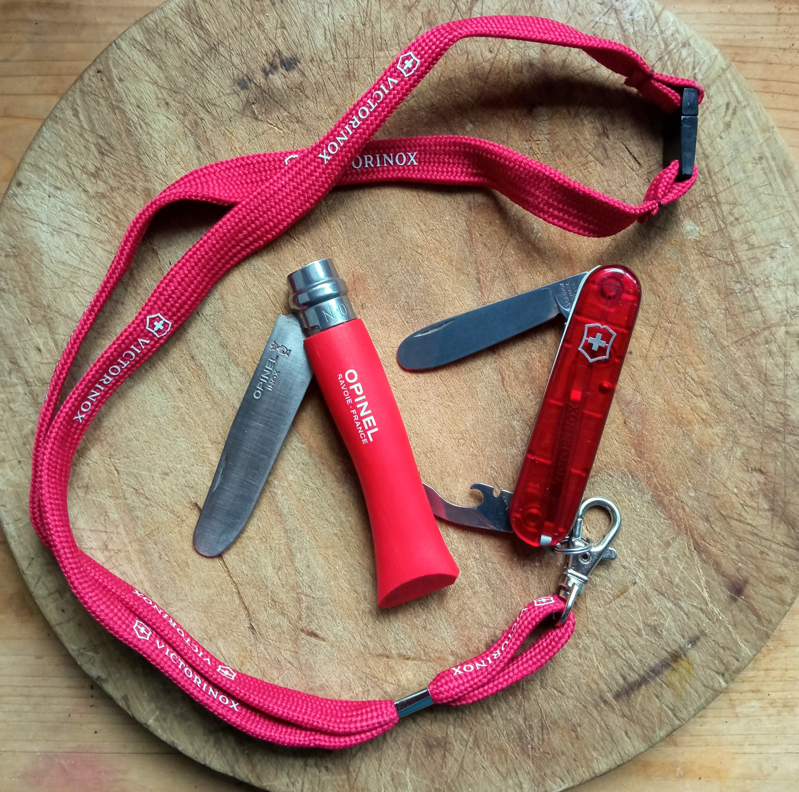

Obě naše děti dostaly v pěti letech svůj první nůž. A začínají se s ním učit zacházet.<!-- more -->

Jako obvykle začnu trochu zeširoka. Na táboře (no tedy ehm v té chatě, kde jsme "na táboře" v létě byli), jsem zjistil jednu věc. Děti a to včetně těch mých, neumí házet. Tedy jinak řečeno, neumí *vzít nějaký předmět a ten přiměřeně razantně a s nějakou +- přesností "mrdnout" na cíl*. 

V rámci nějakého úkolu si děti měly vzít míček a s jeho pomocí trefit plechovku. Nešlo jim to víc než obvykle. Neházely na nějak dlouhou vzdálenost, jejich hody přesto neměly intenzitu a byly úplně mimo. Ani stopa po nějaké eleganci či **náznaku** přesnosti... Nejsem nějaký velký fanatik na drezůru dětí, ostatně sám jsem taky nebyl super šikovné sportovní dítě, ale přesto mě překvapilo, jak děti házet neumí. Takže jsme pak házení na cíl trénovali a tu a tam trénujeme. 

Ale řekl bych, že to širší trend. Děti jsou nyní neustále hlídané. Tráví život v umělém prostředí, kde něco vzít a mrsknout s tím na cíl je dost nežádoucí. V naší školce prý dokonce děti na žádost rodičů nesmí ani chodit ven, když prší. Přece neprochladnou, že jo... No a stejné je to s noži - že by jim ve školce nebo ve škole občas **dali do ruky kudlu**, to ani náhodou. Přitom naučit se smysluplně zacházet s nožem, považuju za jednu z klíčových kompetencí. Stačí se jen podívat, jak i někteří dospělí drží nůž a jak třeba krájí chleba...

Takže obě děti dostaly k pátým narozeninám dětské nože. Rousnice dětský Opinel a Kapustňák dětský "švýcarák". A oba je tak nějak přijaly za své, i když Kapustňák ten svůj trochu víc. Přece jen je klučík a mám dojem, že bude hodně po mně - asociální introvert ISTP :-). Každopádně je dobré děti při práci s nožem pozorovat – konečně totiž musí něčemu věnovat **plnou** pozornost, uvědomují si jisté riziko říznutí.  

Oba dětské nože mají kulatou špičku, která navíc není ostrá, což považuju za dobré bezpečnostní opatření. Jejich ostří je už ale běžně ostré, a proto se s těmito noži dobře učí základní skill - krájení čehokoli. A jaké jsou v této oblasti moje poznatky?

- **Pět let je ideální věk.** Dát pětileťákovi do ruky kudlu? Klidně. Takto staré děti už mají k noži respekt a jsou ochotné se s ním učit zacházet.
- **Chce to dohled.** Ze začátku se může zdát učení děcka s nožem trochu jako adrenalinová zábava. Ale frekvence upozorňování "*bacha na prsty*" a "*pozor na ten palec*" se s časem sníží. Dítě se to naučí a dospělý se trochu otrká.
- **Nejde jen o krájení.** Důležitá jsou i další pravidla, která by se dala shrnout jako "*neběhej tady s tou otevřenou kudlou*". Naučit děti kudlu zavírat, odložit na stůl, když neřežu, a nemávat s ní před obličejem okolním kolemjdoucím.
- **Dobrá je šňůrka**. Hlavně na cestách je dobrý mít kudlu na krku - v tom je ten dětskej švýcarák výbornej. Kudla se šňurkou se taky míň ztrácí. Ale líbí se mi, že ten nůž je asi první z věcí, které si Kapusťnák víc hlídá... Gut.

   